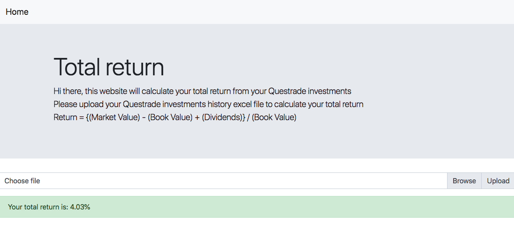

# CalculateTotalReturn

Input your questrade account history excel file and it will calculate your total return

Return = {(Market Value) - (Book Value) + (Dividends)} / (Book Value)

https://calculatetotalreturn.herokuapp.com/

